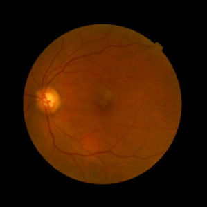
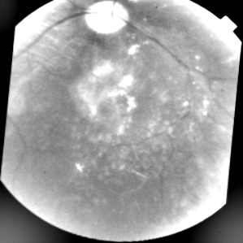
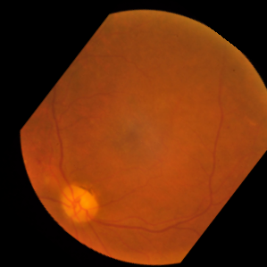

# Early-detection-of-blindnes-using-deep-learning
## Brief Summary
## Millions of people suffer from diabetic retinopathy, the leading cause of blindness among working aged adults.This is  machine learning model to speed up disease detection at early stages.

---
## Large set of retina images taken using fundus photography under a variety of imaging conditions
## Diabetic retinopathy on a scale of 0 to 4
### 0 - No DR
### 1 - Mild
### 2 - Moderate
### 3 - Severe
### 4 - Proliferative 
---
## Dataset - kaggle competitions download -c aptos2019-blindness-detection

# Sample image

---

# Augmented Images

 
 

---
[Link to our project video.](https://youtu.be/Q0kTO78_hic)

* Convolution layer - This layer applies the convolution operation on an image with a defined stride and padding

* Pooling layer - This layer is used for reducing the dimensionality of feature maps by defining a mask and an operation to be p performed, then moving the mask on the whole image according to the stride defined. No weights are learnt in this layer

* Fully Connected layer - Traditional neural layers, used at the end stem of the neural network. Used rarely these days due to the staggering amount of parameters it uses

* Dropout layer - Used for reducing over-fitting. It randomly turns off some neurons at each pass during the training

* Batch Normalisation - Normalises the output values thus reducing computation time. Also introduces regularisation effect

