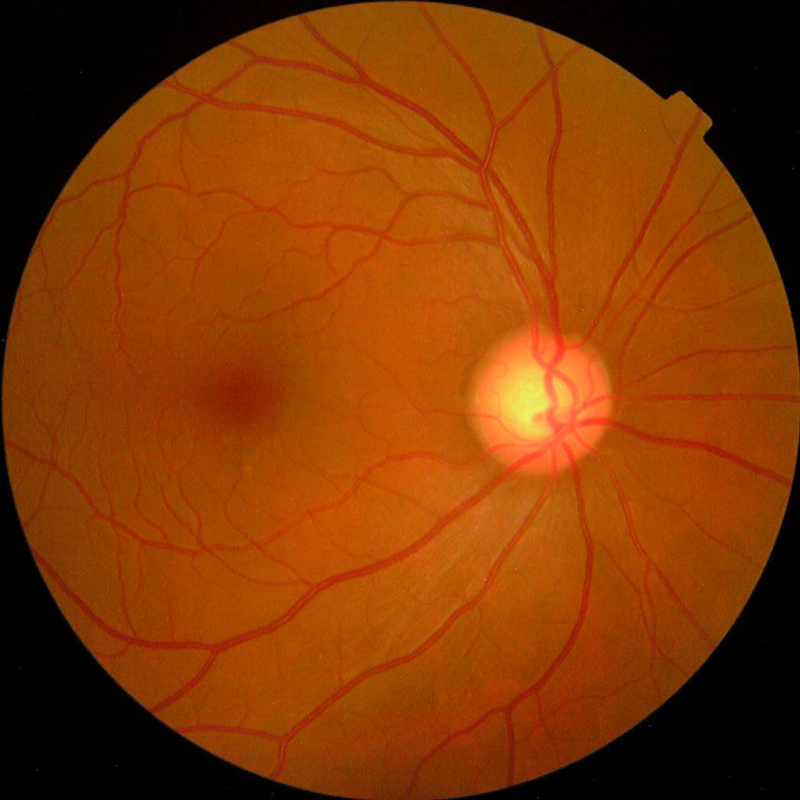

# Early-detection-of-blindnes-using-deep-learning

## Millions of people suffer from diabetic retinopathy, the leading cause of blindness among working aged adults.This is  machine learning model to speed up disease detection at early stages.

---
## Large set of retina images taken using fundus photography under a variety of imaging conditions
## Diabetic retinopathy on a scale of 0 to 4
### 0 - No DR
### 1 - Mild
### 2 - Moderate
### 3 - Severe
### 4 - Proliferative 
---
## Dataset - kaggle competitions download -c aptos2019-blindness-detection

